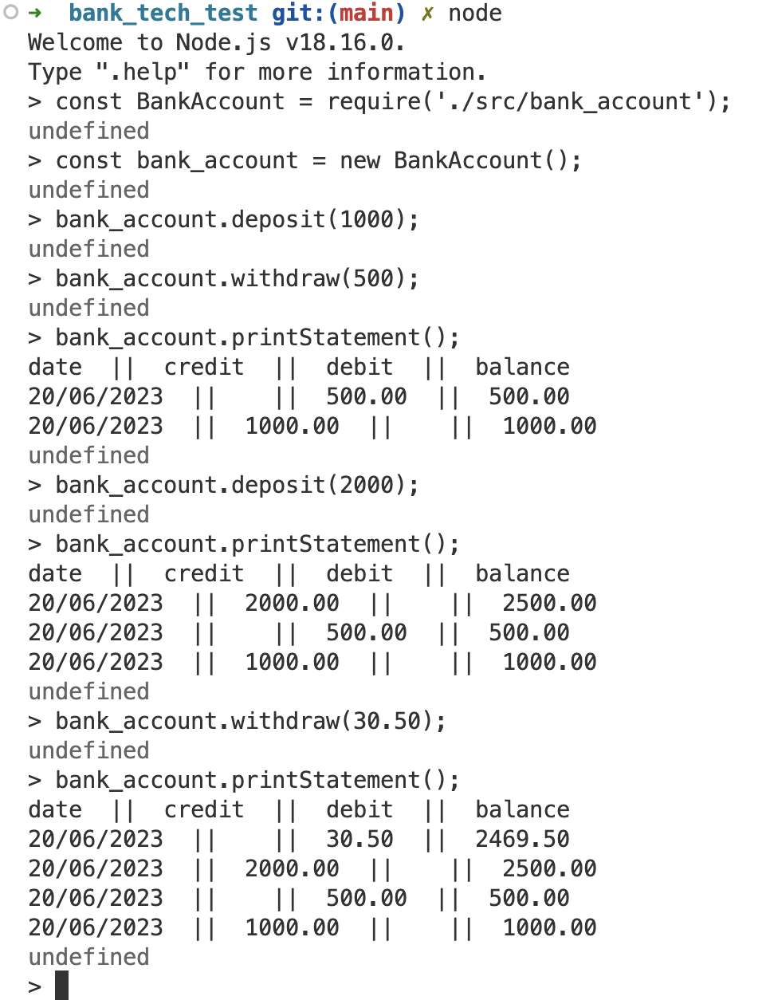

# Bank Account Transaction System :tada:

This is a very simple account transaction system written in Node.js. The system allows users to make deposits and withdrawals and the ability to print the transaction statement.

## Overview

The Bank Account Transaction System aims to emulate simple banking operations. It is designed as a helpful tool for users who want to manage their personal finances or developers seeking to understand basic banking functionality.
```
The requirement for this project are:
1. Implement a REPL interaction
2. Allow bank account deposits
3. Allow bank account withdrawals
4. Provide a bank statement featuring date, amount, and balance
5. Statement must show deposit and withdrawal details
6. Statement needs to display data in a chronological order
7. Use in-memory data storage
8. Implement Test-Driven Development(TDD)
9. Ensure code follows Object-Oriented Design(OOD)
```
## How to approach or solve the problem:
```
1. Create test cases: write test cases for bank account operations that contains deposit, withdrawal, and printing a bank statement. Use Jest's expect and toThrow for testing expected outcomes and exceptions respectively.
2. Setup Mock Date: Use Jest's mockImplementation to mock the current date, to ensure the predictability of the tests' outcome.
3. Write code BankAccount class: In Node.js, the class should contain methods to handle transaction history and exception cases.
4. Implement Transaction Logging: log the transaction in an array with details  like type of transaction (debit/credit), amount, balance, and date, whenever a deposit or withdrawal is made.
5. Create statement printer: the printStatement method should print the bank transactions out in the required format and reverse the transaction array to show the most recent transactions first.
6. Run the test(s): use Jest to run the test(s), if they all pass(the implement is correct), if not pass, debug and adjust the code based on failed test cases.
7. Interact with the code: Via REPL like Node at the terminal. Test the deposit, withdrawal, and printStatement methods to verify their functionality.

```
## Getting started

These instructions will get you a copy of the project up and running on your local machine for development and testing purposes.

## Prerequisites

Ensure you have met the following requirements:
* You have Node.js and npm installed on your local environment. If you do not have these yet, please find the installation details here:
```
:link: https://nodejs.org/en/download 
```

### Installing

1. Clone the project repository:
```
git clone https://github.com/csanann/bank_tech_test.git
```
2. Navigate to the project directory: 
```
cd bank_tech_test
```
3. install the dependencies, setup Node.js and jest, ESLint, Coverage: 
```
mpm init -y
npm install --save-dev jest
npm install -g eslint
npm install eslint --save-dev
npx eslint --init

```
Before you install anything, please, double check whether you are at the right directory or not and is it the right version or not.
Also, do not forget to edit or configure the package.json to meet the required testing frameworks before run the test(s).

## Usage

The 'src/bank_account.js' file contains the 'BankAccount' class, which you can use to perform various bank operations.

## Running the Tests

Ensure that your application is functioning as expected by running tests: 
```
npx jest or npm test
```

## Design

The codebase consists of a single class, 'BankAccount', responsible for maintaining the balance and transaction history. It handles deposits, withdrawals, balance checks and printing of statements.

The class diagram would look like this:
```
BankAccount
- - - - - - -
- balance: number
- transactions: array
- deposit(amount: number): void
- withdraw(amount: number): void
- getBalance(): number
- printStatement(): void
```

The 'BankAccount' class has two fields-balance(a number)and transactions(an array of objects). It has four methods for handling the deposits, withdrawals, balance checking, and printing the statement.

## Screenshots 

For a visual overview of the system in action, refer to the following screenshots:+1: :pound: :moneybag:
'''
Before review:
'''

'''
After review: app.js is a simple file(hardcode) to run the application with Node
'''

 '''
 This is index.js which has the interactive CLI
 '''


## License

This project is licensed under the MIT License.